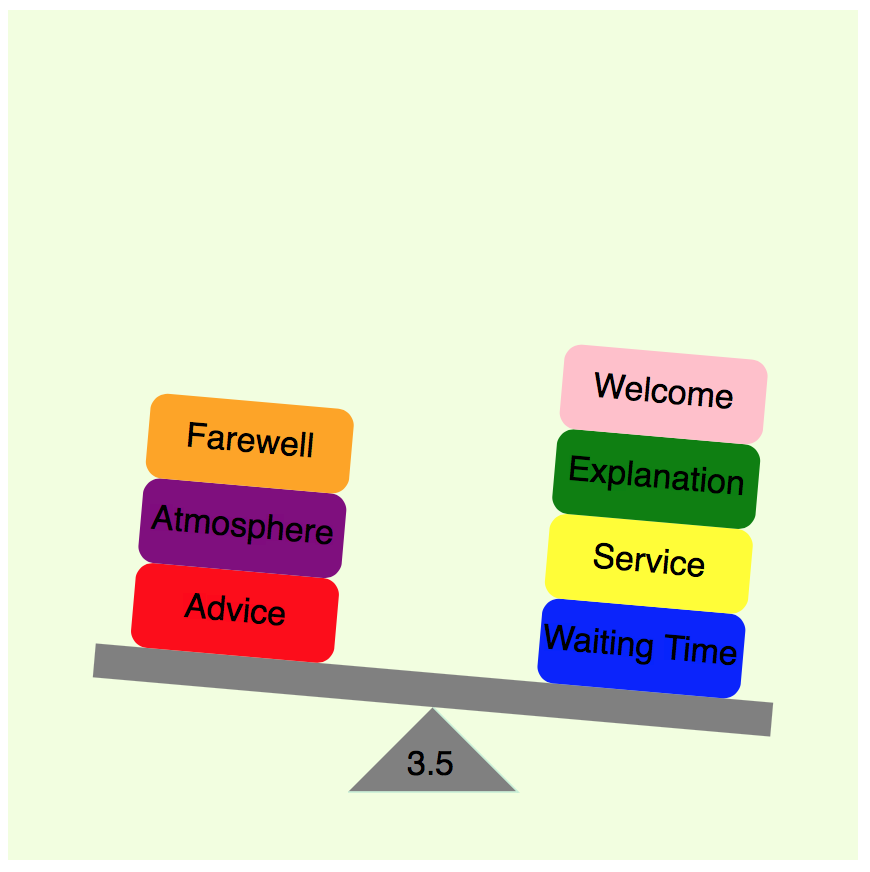

# svg-balance
<h2>A javascript library to render a balance diagram in SVG based on the provided data</h2>

<h1>How to use?</h3>
<h4>Setup dependencies</h4>
<h5>Include the javascript libraries d3.min.js and balance.js in the html page</h5>
<h5>When the balance.js loaded, the 'Balance' object will be instantiated</h5>
<h1>Data to render</h1>
<h5>Setup an array to store the name of the boxes, e.g. ["Advice", "Waiting Time", "Service", "Explanation", "Atmosphere", "Welcome", "Farewell"]</h5>
<h5>Setup the second array to store which side the boxes go; 0 for "LEFT" and 1 for "RIGHT" e.g. [0, 1, 1, 1, 0, 1 ,0]</h5>
<h1>Render</h1>
<h5>Call the 'Balance.visualize()' function to show the result</h5>
<h1>Customize the chart</h1>
<h5>Balance.js allow you to customize:</h5>
<h6>The canvas size (in pixel)- .setSvgSize(700, 700) </h6>
<h7>The chart will generate according to the width and height you specify</h7>
<h7>Best appearance is between range 400 to 1000</h7>
<h7>Best appearance is at width-height ratio 1:1 </h7>
<h6>The background color - .setBg("cyan")</h6>
<h6>The pivot color - .setPivotColor("red")</h6>
<h6>The pivot line color - .setPivotLineColor("blue") </h6>
<h6>The level color - .setLevelColor("black")</h6>
<h6>The inclination of the level (in degree) - .setInclination("15")</h6>
<h6>the colors for the word box - .setWordColor( {an array of box labels and colors} )
<h6>[ {"label": "aaaaa", "color", "yellow"}, {"label": "bbbbb", "color", "green"}, ... , {"label": "ccccc", "color", "blue"}]</h6>    
<h6>Example:</h6>
<h6> .setWordColor(
        [  
            {"label": "Advice", "color": "orange"},
            {"label": "Waiting Time", "color": "green"},
            {"label": "Service", "color": "yellow"},
            {"label": "Explanation", "color": "brown"},
            {"label": "Atmosphere", "color": "purple"},
            {"label": "Welcome", "color": "pink"},
            {"label": "Farewell", "color": "pink"}            
        ]
    )
</h6>

